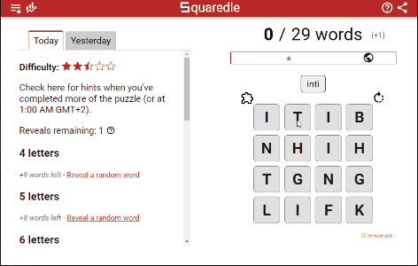

# squaredle-solver
It solves squaredle.app without bruteforcing (too much)



## Disclaimer
This project was made as a coding challenge and should not be used to cheat to become the center of attention at your local scrabble convention.

Thus, I will not upload the entire word dictionary, in order to reduce the number of cheaters.

## How to use

```
# create virutal environment 
python -m venv .venv

# activate environment
.venv/Scripts/activate

# install requirements
pip install -r requirements.txt

# start the script
python main.py

# write down the letters in the squaredle separated by space
example: itib nhih tgng lifk
```

If you want to terminate the program, drag the cursor to one of the corners of the screen.